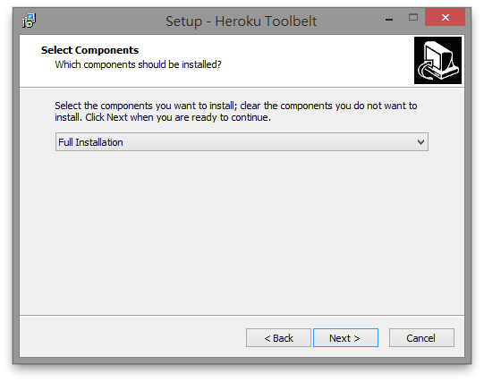
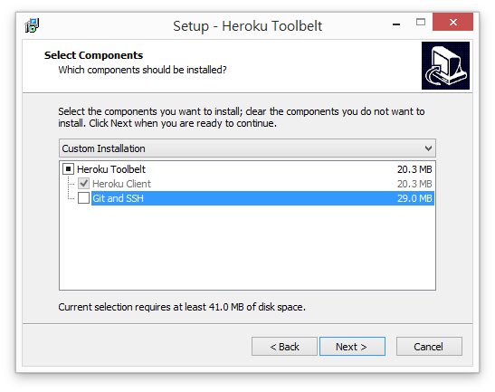
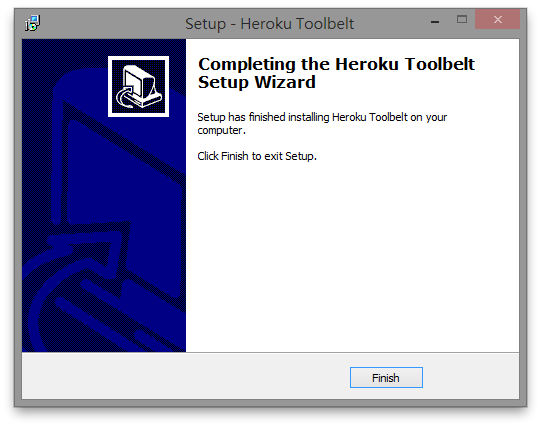

當你的網站完成後，我們必須找個公開的地方來放它，才能讓它被全世界(!)看到。不過在那之前，我們必須先設定一下。在這個教學中，我們會帶領你設定、使用 **[Heroku](http://heroku.com/)** 這個專門讓你放置網站的服務。


## 註冊 Heroku 帳號

首先我們要註冊一個帳號。前往 <https://id.heroku.com/signup>，輸入你的 Email 信箱，然後點選「Sign Up」按鈕。

稍等幾分鐘後，去你輸入的信箱收信。你應該會收到一封像這樣的 Email：


點選第二行的連結後，應該會出現一個網頁。請在「Password」與「Confirm Password」輸入密碼後，按下 Save 完成註冊。

> 如果你把下面的框框打勾，Heroku 就會寄一些活動廣告給你。勾不勾都可以。

按下 Save 後等一陣子，直到 **A moment please** 的字樣消失後，就代表註冊完成！


## 安裝 Heroku 工具

接著要安裝 Heroku 工具，好讓我們能在命令列使用 Heroku。

((( windows

點選[這個連結](https://toolbelt.heroku.com/download/windows)下載安裝程式，並雙擊執行。如果出現「不明發行者」的警告視窗，請直接按「是」繼續執行。進入安裝程式後一直按「Next」，直到看見這個畫面：



請把「Full Installation」改成「Custom Installation」，然後在出現的方塊中把「Git and SSH」**取消勾選**，像這樣：



按下「Next」，來到這個畫面：


接著按「Install」直接開始安裝。完成後會看到這個畫面：



按下「Finish」，完成安裝。

)))

((( osx linux

打開終端機，輸入以下指令安裝 Heroku 工具程式：

```console
wget -O- https://toolbelt.heroku.com/install-ubuntu.sh | sh
---osx
brew install heroku
```

)))

## 設定 Heroku 工具

在終端機內輸入以下指令：

```console
heroku login
```

接著依照指示，輸入你剛剛用來註冊 Heroku 的 Email 與密碼。注意輸入密碼時不會顯示！

如果你看到類似這樣的文字：

```
Your Heroku account does not have a public ssh key uploaded.
Found an SSH public key at C:/Users/Tzu-ping Chung/.ssh/id_rsa.pub
Would you like to upload it to Heroku? [Yn]
```

請按一次 enter。

如果你看到下面這行字：

```
Authentication successful.
```

並且回到 prompt，就代表設定成功了！

> 你的信箱可能會收到一封標題是「Key added to your Heroku account」的信。這是正常的！因為我們是第一次在這台電腦登入 Heroku，所以它需要確認這台電腦確實屬於你。反過來說，如果哪天你沒用新電腦登入，卻收到這封信，可能就要問一下 Heroku 出了什麼事囉！

## 安裝 Heroku 用的 Python 套件

確認終端機有在[虛擬環境](https://djangogirlstaipei.gitbooks.io/django-girls-taipei-tutorial/django/installation.html)內。若沒有，則先參照前面的教學，進入虛擬環境。接著輸入：

```console
pip install dj-database-url gunicorn dj-static
```

等一段時間，直到終端機顯示 *Successfully installed...*，表示必要的套件都已經安裝完成。


## 增加設定檔，讓 Heroku 認識你的專案

我們必須增加一些設定，Heroku 才知道要怎麼執行這個網站。本章節的所有檔案，都必須放在 `djangogirls` 專案目錄底下。

### `requirements.txt`

利用以下的指令將此虛擬環境裡的 Python 套件全部條列出來，包括套件名稱與版本資訊，並儲存於 [requirements.txt](https://devcenter.heroku.com/articles/python-pip#the-basics)：

```console
pip freeze > requirements.txt
```

由於 Heroku 使用 [PostgreSQL](http://www.postgresql.org/) 資料庫，我們還需要手動在 `requirements.txt` 最後面加上 `psycopg2==2.6.1`（Python 的 PostgreSQL 模組）。最終的檔案內容範例如下，版本可能會稍有不同：

```
Django==1.8.6
appnope==0.1.0
decorator==4.0.4
dj-database-url==0.3.0
dj-static==0.0.6
gnureadline==6.3.3
gunicorn==19.3.0
ipython==4.0.0
ipython-genutils==0.1.0
path.py==8.1.2
pexpect==4.0.1
pickleshare==0.5
ptyprocess==0.5
simplegeneric==0.8.1
static3==0.6.1
traitlets==4.0.0
psycopg2==2.6.1
```

### `Procfile`

繼續在 `djangogirls` 建立一個 [Procfile](https://devcenter.heroku.com/articles/procfile) 文字檔，包含以下的內容。注意不能有副檔名！

```
web: gunicorn --pythonpath mysite mysite.wsgi
```

這一行指令分成兩個部分，其格式 `<process_type>: <command>` 表示：

* 啟用名為 `web` 的應用
* 用 `gunicorn` 執行 `mysite.wsgi` 這個模組

[Gunicorn](http://gunicorn.org/) 是一個用 Python 開發的 WSGI 工具，可以用來執行 Django 的網站。

### `mysite/mysite/production_settings.py`

在前面的章節中，我們透過修改 `settings.py` 來調整 Django project 的設定，但是通常正式上線（production）的環境會和開發/本機（development/local）環境有所不同。所以我們在 `mysite/mysite/` 底下新建一個 `production_settings.py`，專門放部署時所需要的設定：

```python
# Import all default settings.
from .settings import *

import dj_database_url
DATABASES = {
    'default': dj_database_url.config(),
}

# Static asset configuration.
STATIC_ROOT = 'staticfiles'

# Honor the 'X-Forwarded-Proto' header for request.is_secure().
SECURE_PROXY_SSL_HEADER = ('HTTP_X_FORWARDED_PROTO', 'https')

# Allow all host headers.
ALLOWED_HOSTS = ['*']

# Turn off DEBUG mode.
DEBUG = False
```

### `wsgi.py`

[WSGI - Web Server Gateway Interface](http://webpython.codepoint.net/wsgi_tutorial) 是 Python 定義網頁程式和伺服器溝通的介面。為了讓 Heroku 的服務能夠透過這個介面與我們的網站溝通。**修改** `mysite/mysite/wsgi.py` 如下：

```python
# mysite/mysite/wsgi.py

import os

from django.core.wsgi import get_wsgi_application

from dj_static import Cling

os.environ.setdefault("DJANGO_SETTINGS_MODULE", "mysite.settings")

application = Cling(get_wsgi_application())
```

我們將 [dj_static](https://github.com/kennethreitz/dj-static) 引入，並在 `application` 上使用它，以協助幫我們部署 static 檔案（例如圖片、CSS、JavaScript 檔案等等）。

### `.gitignore`

我們不希望把有些開發時使用的檔案，例如虛擬環境、本機資料庫等等，都一股腦放到網路上。因此，接下來需要建立一個 [.gitignore](http://git-scm.com/docs/gitignore) 檔案，排除這些資料：

```
# djangogirls/.gitignore

djangogirls_venv
*.pyc
__pycache__
staticfiles
db.sqlite3
```

注意這個檔案是以點 `.` 開頭，且 `gitignore` 後面沒有其他的副檔名。

### 小結

完成上面的步驟後，最後的專案結構應該如下：

```
djangogirls
├──mysite
│   ├── mysite
│   │   ├── __init__.py
│   │   ├── production_settings.py
│   │   ├── settings.py
│   │   ├── urls.py
│   │   └── wsgi.py
│   ├── templates
│   ├── trips
│   └── manage.py
├── djangogirls_venv
├── .gitignore
├── Procfile
├── requirements.txt
└── runtime.txt
```

## 部署！

在部署之前，請務必確認前面的步驟都已經確實完成，包含：

* 註冊 Heroku 帳號
* 安裝 Heroku Toolbelt
* 安裝 Heroku 相關的 Python 元件
* 產生必要的設定檔

### 建立 Git Repository

在 `djangogirls` 資料夾底下新增一個 git repository：

```console
git init
git add .
git commit -m "my djangogirls app"
```

### Heroku Toolbelt 登入

安裝完工具箱裡的 Heroku client 後，就可以使用 `heroku` 指令，首先讓我們登入：

```console
heroku login
```

輸入註冊時的 Email 帳號和密碼，當你看到 *Authentication successful.* 時，表示認證成功。

### 新增新的 Heroku App

接下來，我們需要新增一個可以上傳 repository 的地方：（如果你之前已經新增過，請直接跳到下一個步驟）

```console
heroku create
```

預設 `create` 後面不放名字時，會自動產生隨機名稱的 Heroku app，如果想要命名自己的 app，則可以直接在後面指定，例如

```console
heroku create djangogirlsdiary
```

注意：

* Heroku app 名稱不能重複，所以你可能會看到

    ```
    !    Name is already taken
    ```

    這樣的警告。不要緊張，只要換一個名稱試試就好。

* Heroku app 名稱會顯示在 deploy 成功後的網址上。如果你的 app 名叫 `djangogirlsdiary`，那麼最後的公開網址就會是 <https://djangogirlsdiary.herokuapp.com>。

### 將 Heroku App 指定給專案

如果你之前已經新增過 app ，並且想發佈在已經存在的 app 上時，可以先用指令 `heroku apps` 查看 app 的名稱。根據這個名稱，我們可以設定專案的上傳目標：

```console
heroku git:remote -a djangogirlsdiary
```

其中 `-a` 後面需要給定你的 app 名稱。

透過 `git remote -v` 檢查一下是否設定到正確的位置。如果正確，應該會看到類似下面的輸出：

```
heroku    https://git.heroku.com/<Heroku app 名稱>.git (fetch)
heroku    https://git.heroku.com/<Heroku app 名稱>.git (push)
```

### 設定環境變數

利用 `heroku config:set` 指令設置 [環境變數](https://devcenter.heroku.com/articles/config-vars)，以確保未來在 Heroku 執行任何指令時，都是使用到部署專用的設定檔：

```console
heroku config:set DJANGO_SETTINGS_MODULE=mysite.production_settings
```

### 將專案上傳到 Heroku

Heroku 使用 Git 管理專案。當我們想把專案上傳到 Heroku 時，必須使用 `git push` 指令，把檔案從畚箕「推」上去。

```console
git push heroku master
```

你會看到類似下面的一長串輸出：

```
remote: Compressing source files... done.
remote: Building source:
remote:
remote: -----> Python app detected
remote: -----> Installing runtime (python-3.4.3)
remote: -----> Installing dependencies with pip
...
remote: -----> Compressing... done, 50.8MB
remote: -----> Launching... done, v1
remote:        https://djangogirlsdiary.herokuapp.com/ deployed to Heroku
remote:
remote: Verifying deploy... done.
To https://git.heroku.com/djangogirlsdiary.git
 * [new branch]      master -> master
```

等到所有輸出完成，重新出現 prompt 時，就代表一切完成。

如果你遇到下列的錯誤訊息：

```
Permission denied (publickey).
fatal: The remote end hung up unexpectedly
```

請透過下列指令新增 public key，然後再重新 `git push`。

```console
heroku keys:add
```

### 網站初始化

在第一次上傳專案後，我們必須稍微做一點設定，讓 Heroku 有正確的初始環境。首先用下面的指令，告訴 Heroku 我們需要一台機器（Heroku 叫 dyno）來執行網站：

```console
heroku ps:scale web=1
```

接著用下面的指令初始化資料庫：

```console
heroku run python mysite/manage.py migrate
```

並為後台建立一個使用者：

```console
heroku run python mysite/manage.py createsuperuser
```

你應該已經在 [Models](https://djangogirlstaipei.gitbooks.io/django-girls-taipei-tutorial/django/models.html) 與 [Admin](https://djangogirlstaipei.gitbooks.io/django-girls-taipei-tutorial/django/admin.html) 這兩節裡看過這兩個指令。如果不記得它們的用途，可以回去複習一下。Heroku 的資料庫和本機是分開的，不會同步，所以我們需要重新執行它們。在前面加上 `heroku run`，會讓它們在 Heroku 被執行，而不是我們的電腦上。

### 看結果！

在瀏覽器輸入 `https://<Heroku app 名>.herokuapp.com`，就可以看到你的網站。或者如果嫌麻煩，也可以使用下面的指令：

```console
heroku open
```

### 未來的更新

前面提到，Heroku 使用 Git 管理專案。未來想要上傳新版本時，只要用 `git commit` 建立一個版本，然後用 `git push heroku master` 就可以上傳到 Heroku。
